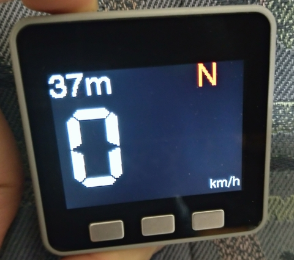
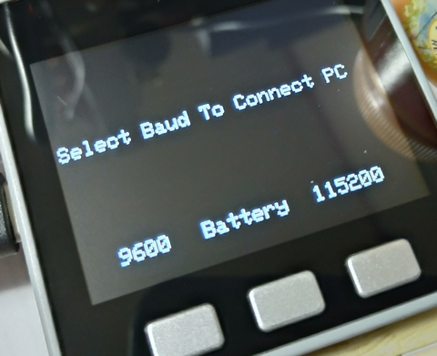

GPS Speed Meter for Car

# Hardware
M5Stack + M5STACK-GPS-02(NEO-M8N)  
* Display GPS speed, altitude, heading  
* Automatic dimmer while 18:00 - 6:00 JST  
* Automatic sleep when USB power is not connected

# How to use

## Configure GPS Module (First Time)
1. Download U-Center(https://www.u-blox.com/en/product/u-center)
2. Connect M5Stack to PC
3. Select 9600bps while opening (push & hold the left button)  

4. Configure GPS Module  
    *  Change Baud to 115200bps
    *  Select update interval (1Hz, 5Hz, 10Hz)

## Configure GPS Module (Second Time)
After you changed GPS moudle baud to 115200bps, you have to select 115200bps at opening display to connect PC.

# Notes
If you don't want to Configure Module, Please change "hSerial.begin(115200);" to "hSerial.begin(9600);".  
Update interval is fixed to 1Hz.
